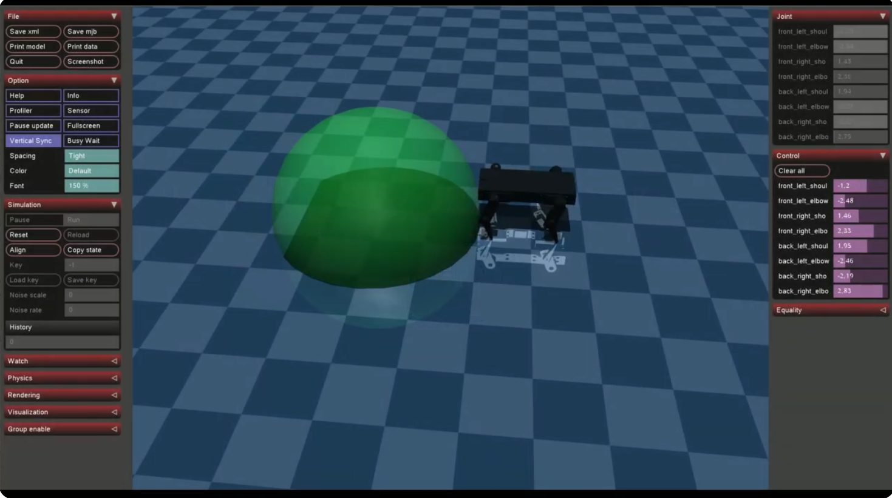

# Crank Bot

Crank Bot is a basic four-legged robot project. The name comes from its black look, but mechanically it is a small quadruped that can be 3D printed and assembled.

The repository includes the STL files in [`assets/`](assets/) and a first basic MuJoCo simulation model.

## Bill of Materials

Initial BOM:

- 4x MG995 or MG996 servos
- 4x MG90S servos
- 1x PCA9685 servo driver
- 1x ESP32-C3 microcontroller
- 1x 5 V or 6 V BEC, minimum 5 A, preferably 10 A
- 1x MP1584 buck converter for the microcontroller
- 1x 2S LiPo battery
- 3D printed parts from [`assets/`](assets/)

## Simulation

The repository currently contains a basic MuJoCo XML model of the robot. A Python script will be added later to interact with the simulation.

## Training

The Gymnasium environment is [`scripts/crankbot_walk_gym_env.py`](scripts/crankbot_walk_gym_env.py). It wraps the CPU MuJoCo vectorized environment as a single-env Gym API for SAC training.

| Mode | Observation size | Contents |
| --- | ---: | --- |
| Default | 80 | Actor observation + privileged simulator state |
| `--disable-privileged` | 68 | Actor observation only |

Actor observation:

| Term | Size | Meaning |
| --- | ---: | --- |
| `q_cmd_history` | 32 | 4-step history of 8 commanded joint targets, as `q_cmd - q_stand` |
| `action_history` | 32 | 4-step history of 8 normalized actions |
| `goal_bearing / pi` | 1 | Relative goal direction |
| `goal_range / target_goal_range` | 1 | Normalized distance to the goal |
| `sin(phase), cos(phase)` | 2 | Gait phase signal |

Standing reference pose:

| Joint order | `front_left_shoulder` | `front_left_elbow` | `front_right_shoulder` | `front_right_elbow` | `back_left_shoulder` | `back_left_elbow` | `back_right_shoulder` | `back_right_elbow` |
| --- | ---: | ---: | ---: | ---: | ---: | ---: | ---: | ---: |
| `q_stand` rad | -1.15 | -2.34 | 1.15 | 2.34 | 2.00 | -2.34 | -2.00 | 2.34 |

Privileged extra observation:

| Term | Size | Meaning |
| --- | ---: | --- |
| `base_velocity_body` | 3 | Local base velocity, including yaw rate |
| `base_z` | 1 | Base height |
| `roll_pitch` | 2 | Base tilt |
| `foot_contacts` | 4 | Foot contact flags |
| `leg_contact` | 1 | Upper-leg ground contact |
| `body_contact` | 1 | Base ground contact |

Actions are 8 normalized joint command increments:

$$
q_{cmd,t+1} = clip(q_{cmd,t} + a_t \cdot action\_scale,\ q_{min},\ q_{max}),\quad a_t \in [-1, 1]^8
$$

Reward:

$$
r = -tanh(goal\_range / goal\_reward\_scale) - c_s ||a_t-a_{t-1}||^2 - c_a ||a_t||^2 - p_{idle} - p_{leg} - p_{lower} - p_{body} - p_{fall}
$$

| Term | Meaning |
| --- | --- |
| $-tanh(goal\_range / goal\_reward\_scale)$ | Goal progress term; less negative as the robot gets closer to the target |
| $-c_s \|\|a_t-a_{t-1}\|\|^2$ | Smoothness penalty for abrupt action changes |
| $-c_a \|\|a_t\|\|^2$ | Action magnitude penalty |
| $-p_{idle}$ | Penalty for sending nearly zero action while the goal is not reached |
| $-p_{leg}$ | Penalty when upper-leg collision geoms touch the floor |
| $-p_{lower}$ | Penalty when lower-leg collision geoms touch the floor |
| $-p_{body}$ | Penalty when the base touches the floor |
| $-p_{fall}$ | Fall penalty when base height is below the fall threshold |

After training with SAC, this behavior has been obtained:

## Future Work

- Include some dynamics/noise randomization in the learning.
- Execute the trained policy in the real hardware.
