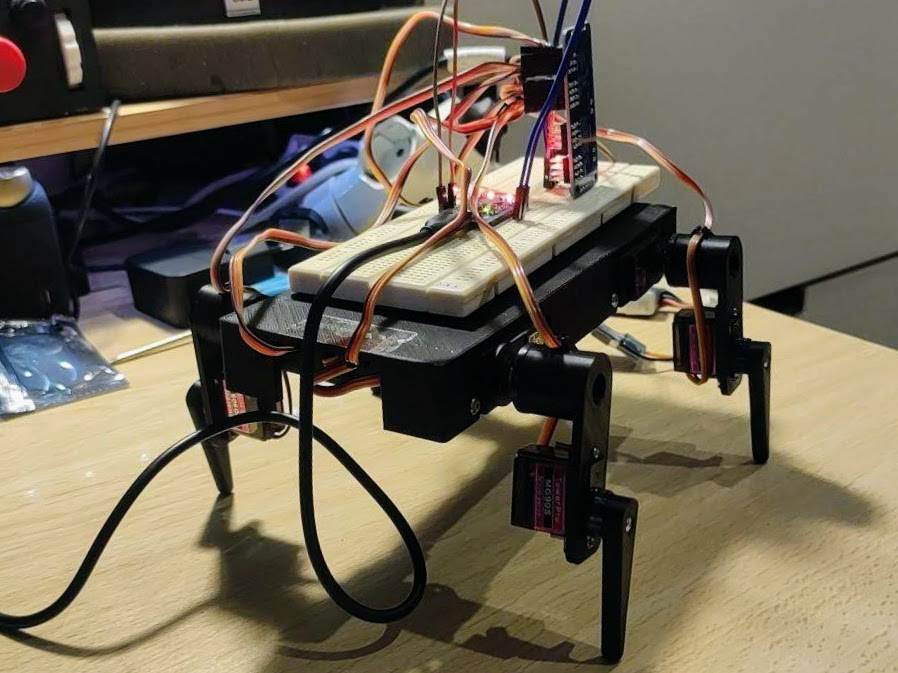
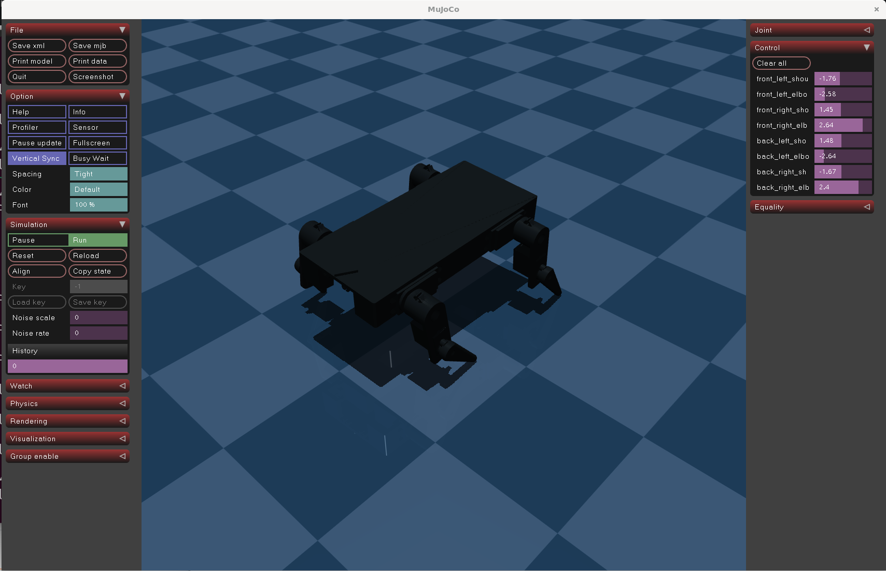

# Crank Bot

Crank Bot is a basic four-legged robot project. The name comes from its black look, but mechanically it is a small quadruped that can be 3D printed and assembled.

The repository includes the STL files in [`assets/`](assets/) and a first basic MuJoCo simulation model.

## Bill of Materials

Initial BOM:

- 4x MG995 or MG996 servos
- 4x MG90S servos
- 1x PCA9685 servo driver
- 1x ESP32-C3 microcontroller
- 1x 5 V or 6 V BEC, minimum 5 A, preferably 10 A
- 1x MP1584 buck converter for the microcontroller
- 1x 2S LiPo battery
- 3D printed parts from [`assets/`](assets/)

## Simulation

The repository currently contains a basic MuJoCo XML model of the robot. A Python script will be added later to interact with the simulation.

## Future Work

- Add a Python interface for the MuJoCo simulation.
- Build an environment for programming policies that learn to walk.
